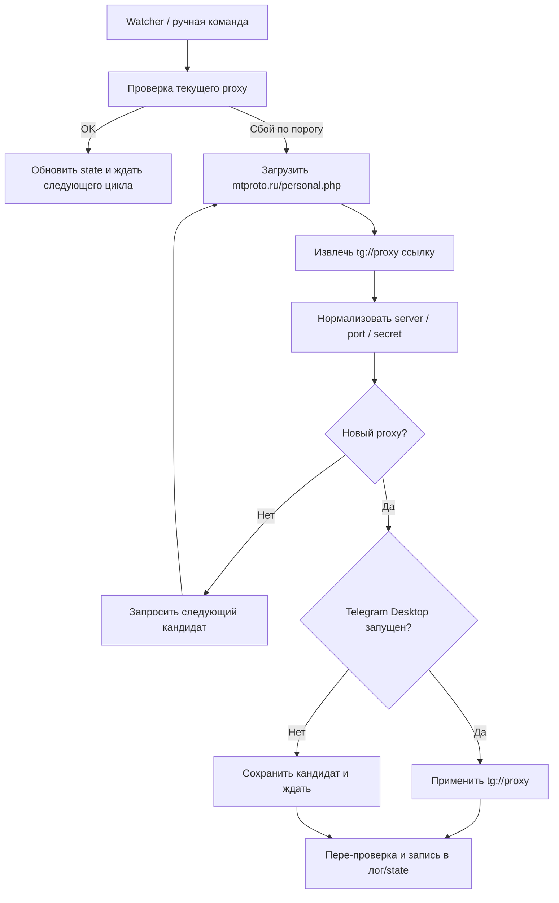

# ProtoSwitch

**ProtoSwitch v0.1.0-beta.1** - CLI/TUI на Rust для Telegram Desktop с фокусом на Windows, который помогает быстро заменить MTProto proxy, если текущий перестал работать.

Проект рассчитан на пользователей Windows 10/11, которым нужен понятный инструмент без ручного копирования адресов, портов и secret в настройки Telegram. ProtoSwitch следит за состоянием текущего proxy, может подобрать новый с `mtproto.ru`, применить его через официальный `tg://proxy?...` deep link и дать понятную диагностику, если что-то пошло не так.

## Для чего нужен ProtoSwitch

- Автоматизирует смену MTProto proxy для Telegram Desktop.
- Снижает количество ручных действий, когда proxy "умирает" в неподходящий момент.
- Дает как обычные CLI-команды, так и TUI-интерфейс для первого запуска и просмотра состояния.
- Работает в пользовательском режиме и не требует редактирования `tdata`.

## Что умеет версия v0.1.0-beta.1

- Инициализация конфигурации и первичная проверка окружения.
- Фоновый watcher для проверки состояния текущего proxy.
- Ручная и автоматическая смена proxy.
- Диагностика Telegram protocol handler, сетевой доступности источника и локальных путей.
- Установка и удаление автозапуска через задачу Windows для текущего пользователя.

## Основные команды

| Команда | Что делает |
| --- | --- |
| `protoswitch init` | Создает и настраивает конфиг, проверяет наличие Telegram Desktop и обработчика `tg://`. |
| `protoswitch watch` | Запускает watcher, который проверяет текущий proxy и подбирает замену при сбоях. |
| `protoswitch status` | Показывает текущее состояние: активный proxy, последние успешные операции, состояние watcher. |
| `protoswitch switch` | Принудительно получает новый proxy и пытается применить его вручную. |
| `protoswitch doctor` | Проверяет источник proxy, protocol handler Telegram, пути хранения и общее состояние окружения. |
| `protoswitch autostart install` | Создает per-user Scheduled Task для автозапуска ProtoSwitch при входе в Windows. |
| `protoswitch autostart remove` | Удаляет задачу автозапуска ProtoSwitch. |

## Где ProtoSwitch хранит данные

| Назначение | Путь |
| --- | --- |
| Конфиг | `%APPDATA%\ProtoSwitch\config.toml` |
| Runtime state | `%LOCALAPPDATA%\ProtoSwitch\state.json` |
| Логи watcher | `%LOCALAPPDATA%\ProtoSwitch\logs\watch.log` |

`config.toml` хранит рабочие параметры: интервалы проверок, таймауты, настройки автозапуска и сведения об источнике proxy.  
`state.json` хранит текущее состояние watcher: последний выбранный proxy, время успешной проверки, время последнего применения и следующую проверку.  
`watch.log` нужен для разбора проблем, когда proxy сменился не так, как ожидалось.

## Как это работает

ProtoSwitch не редактирует внутренние файлы Telegram Desktop. Вместо этого он использует официальный deep link вида `tg://proxy?...`, который понимает клиент Telegram.

На высоком уровне процесс такой:

1. Watcher проверяет текущее состояние proxy best-effort способом.
2. Если подряд набирается порог ошибок, ProtoSwitch идет к `mtproto.ru`.
3. Из страницы `https://mtproto.ru/personal.php` извлекается встроенная ссылка `tg://proxy?...`.
4. Ссылка нормализуется в данные `server`, `port`, `secret`.
5. ProtoSwitch отбрасывает очевидные дубликаты, чтобы не крутиться вокруг одного и того же proxy.
6. Если Telegram Desktop уже запущен, ProtoSwitch передает в систему `tg://proxy?...` для применения.
7. Если Telegram закрыт, watcher сохраняет кандидат и ждет запуска Telegram или ручной команды `switch`.

## Быстрый сценарий использования

1. Запустите `protoswitch init`.
2. Убедитесь, что `protoswitch doctor` не показывает критических ошибок.
3. Если нужен автоматический режим при входе в систему, выполните `protoswitch autostart install`.
4. Для постоянного мониторинга используйте `protoswitch watch`.
5. Если нужно срочно сменить proxy вручную, выполните `protoswitch switch`.
6. Когда нужно быстро понять текущее состояние, используйте `protoswitch status`.

## Что важно знать про источник proxy

ProtoSwitch в этой бета-версии ориентирован только на `mtproto.ru`. Источник используется как поставщик готовых MTProto-кандидатов:

- программа загружает страницу `personal.php`;
- ищет в ней встроенную `tg://proxy` ссылку;
- извлекает из ссылки параметры подключения;
- кэширует недавние варианты, чтобы не брать один и тот же proxy сразу повторно.

Это значит, что стабильность работы напрямую зависит от доступности `mtproto.ru` и от того, не изменится ли структура страницы.

## Ограничения v0.1.0-beta.1

- Поддерживается только Windows 10/11.
- Рассчитано только на Telegram Desktop.
- Источник proxy только один: `mtproto.ru`.
- Проверка работоспособности proxy в этой версии best-effort и не эмулирует полноценную MTProto-сессию.
- Watcher не должен сам запускать Telegram, если клиент закрыт.
- Если в системе не зарегистрирован обработчик `tg://`, автоматическое применение proxy работать не будет до исправления окружения.
- Создание Scheduled Task для автозапуска может блокироваться политиками Windows или правами текущего пользователя.

## Когда использовать `doctor`

Команда `protoswitch doctor` нужна, если:

- Telegram Desktop не подхватывает новый proxy;
- `watch` не может применить кандидат;
- `status` показывает ошибки последних проверок;
- автозапуск не сработал после входа в Windows;
- есть подозрение, что недоступен `mtproto.ru`.

## Статус проекта

`v0.1.0-beta.1` - ранняя бета-версия. Основной фокус здесь на рабочем Windows-сценарии, понятной диагностике и удобной смене MTProto proxy без ручного редактирования Telegram.

macOS-версия запланирована отдельно и в эту сборку не входит.
