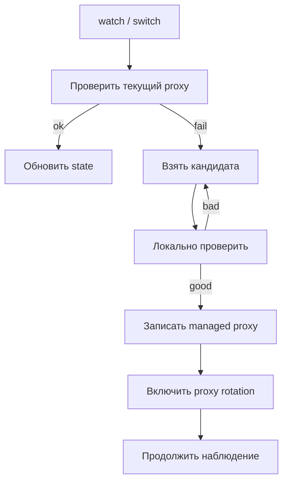

# ProtoSwitch

**ProtoSwitch v0.2.0-beta.4** — terminal-first утилита для Telegram Desktop, которая следит за состоянием proxy, подбирает замену из бесплатных MTProto/SOCKS5-источников и записывает managed proxy в настройки Telegram без popup и без focus stealing.

## Что Есть Сейчас

- watcher для фоновой проверки и ротации proxy;
- adaptive TUI с режимами `Обзор`, `Команды`, `Источники`, `История`;
- индикатор в системной области через `protoswitch tray`;
- managed backend для `tdata/settingss`, чтобы не засорять Telegram случайными нерабочими адресами;
- ручной `switch` для немедленного поиска и записи managed proxy;
- structured UTF-8 логи без старого `String::from_utf8_lossy`-хаоса;
- детерминированный watcher e2e-слой внутри репозитория и отдельный opt-in live Windows smoke;
- Windows installer + portable-артефакты для Windows, Linux и macOS;
- автозапуск через `Scheduled Task` / `Startup folder` на Windows, XDG autostart на Linux и LaunchAgent на macOS.

## Артефакты

| Файл | Назначение |
| --- | --- |
| `ProtoSwitch-Setup-x64.exe` | обычная установка для Windows x64 |
| `protoswitch-portable-win-x64.zip` | portable для Windows x64 |
| `protoswitch-portable-linux-x64.tar.gz` | portable для Linux x64 |
| `protoswitch-portable-linux-arm64.tar.gz` | portable для Linux arm64 |
| `protoswitch-portable-macos-x64.tar.gz` | portable для macOS x64 |
| `protoswitch-portable-macos-arm64.tar.gz` | portable для macOS arm64 |

Windows installer остаётся только для Windows. Linux и macOS в этой очереди идут как portable-first beta с CI-smoke на `init`, `status`, `doctor` и `autostart`.

## Как Работает



Фоновый watcher не должен поднимать Telegram поверх других окон. Если клиент уже открыт, ProtoSwitch обновляет managed subset и включает rotation в настройках Telegram, не открывая `tg://`-диалог.

## Как Читать Статусы

- `active` — текущий managed proxy проходит проверку и остаётся рабочим.
- `saved to managed settings` — replacement proxy уже сохранён в `settingss`.
- `source empty / no free proxies` — источник сейчас пуст или временно не смог выдать новый proxy.
- `managed settings` — proxy записан в настройки Telegram без открытия отдельного окна подтверждения.

## Надёжность И E2E

- Детерминированный e2e-набор проверяет watcher path `fetch -> local validate -> pending/managed apply -> status/doctor -> cleanup` без живого Telegram и без интернета.
- Sandbox e2e использует реальный бинарный roundtrip `tdata/settingss`, а не текстовые моки формата Telegram.
- Для ручной проверки на живом Windows/Telegram есть `scripts/e2e-windows-live.ps1` с обязательным backup/restore реального `settingss`.
- Packaging в release CI теперь блокируется на зелёном watcher e2e для Windows.

## Быстрый Старт

### Windows

1. Установите `ProtoSwitch-Setup-x64.exe` или распакуйте `protoswitch-portable-win-x64.zip`.
2. Запустите `protoswitch.exe` без аргументов.
3. Проверьте состояние:
   `protoswitch status --plain`
   `protoswitch doctor`
4. При необходимости включите автозапуск:
   `protoswitch autostart install`
5. Для ручной смены proxy:
   `protoswitch switch`

### Linux / macOS

1. Распакуйте portable-архив под свою архитектуру.
2. Запустите:
   `./protoswitch init --non-interactive --no-autostart`
3. Проверьте состояние:
   `./protoswitch status --plain`
   `./protoswitch doctor`
4. Для фоновой работы:
   `./protoswitch tray`

## Основные Команды

| Команда | Что делает |
| --- | --- |
| `protoswitch init` | создаёт или обновляет `config.toml` |
| `protoswitch status` | показывает текущее состояние proxy, backend и автозапуска |
| `protoswitch watch` | запускает watcher |
| `protoswitch tray` | показывает системный индикатор и держит watcher запущенным |
| `protoswitch switch` | сразу ищет и применяет новый proxy |
| `protoswitch cleanup` | чистит dead ProtoSwitch-owned proxy из managed subset |
| `protoswitch doctor` | проводит диагностику окружения |
| `protoswitch repair` | восстанавливает локальную установку |
| `protoswitch shutdown` | полностью останавливает процессы ProtoSwitch |
| `protoswitch autostart install` | включает автозапуск |
| `protoswitch autostart remove` | выключает автозапуск |

## Конфиг И Данные

В `config.toml` закреплён блок:

```toml
[telegram]
client = "desktop"
backend_mode = "hybrid"
data_dir = ""
```

`backend_mode`:

- `managed` — только запись в `settingss`;
- `hybrid` — managed path по умолчанию, live fallback только для явных ручных действий;
- `manual` — без фонового live-apply watcher всё равно остаётся silent-only.

Каталоги данных:

| ОС | Конфиг | State / logs | Автозапуск |
| --- | --- | --- | --- |
| Windows | `%APPDATA%\ProtoSwitch\config.toml` | `%LOCALAPPDATA%\ProtoSwitch\state.json`, `%LOCALAPPDATA%\ProtoSwitch\logs\watch.log` | `Scheduled Task` или `Startup folder` |
| Linux | XDG config dir | XDG data dir | `~/.config/autostart/protoswitch.desktop` |
| macOS | `~/Library/Application Support/ProtoSwitch` | `~/Library/Application Support/ProtoSwitch` | `~/Library/LaunchAgents/com.thelitis.protoswitch.plist` |

## Источники Proxy

По умолчанию ProtoSwitch использует пул из нескольких бесплатных лент:

- `mtproto.ru`
- `SoliSpirit/mtproto`
- `Argh94/Proxy-List` для `MTProto`
- `Argh94/Proxy-List` для `SOCKS5`
- `proxifly/free-proxy-list`
- `hookzof/socks5_list`

Новый кандидат сначала проходит локальную проверку, и только потом попадает в managed subset Telegram.

## Ограничения Beta

- поддерживается только `Telegram Desktop`;
- Linux/macOS уже проходят portable-first smoke в CI, но всё ещё идут без native installer;
- фоновый watcher не открывает `tg://`-диалог и не нажимает кнопки в Telegram; live-поведение опирается на managed settings и Telegram proxy rotation;
- live fallback остаётся только для явных ручных действий `switch` и `repair`, и статус честно покажет, если fallback недоступен;
- live Windows e2e остаётся opt-in локальным сценарием и не запускается в CI на реальном пользовательском Telegram;
- бесплатные proxy и сами публичные источники по природе нестабильны, поэтому приложение всё ещё остаётся beta, а не stable.
