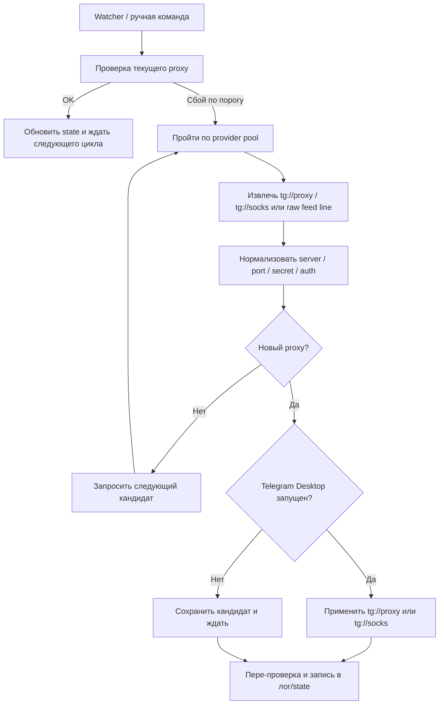

# ProtoSwitch

**ProtoSwitch v0.1.0-beta.9** - CLI/TUI на Rust для Telegram Desktop с фокусом на Windows, который помогает быстро заменить MTProto proxy, если текущий перестал работать.

Проект рассчитан на пользователей Windows 10/11, которым нужен понятный инструмент без ручного копирования адресов, портов и `secret` в настройки Telegram. ProtoSwitch следит за состоянием текущего proxy, может подобрать новый из встроенного пула бесплатных MTProto и SOCKS5-источников, переждать динамический выбор сервера на `mtproto.ru`, применить proxy через официальный `tg://proxy?...` или `tg://socks?...` deep link и подтвердить подключение в Telegram без ручного клика, если окно подтверждения доступно в текущей пользовательской сессии.

## Для чего нужен ProtoSwitch

- Автоматизирует смену MTProto proxy для Telegram Desktop.
- Снижает количество ручных действий, когда proxy "умирает" в неподходящий момент.
- Дает как обычные CLI-команды, так и TUI-интерфейс операторского класса для настройки, диагностики и ручного управления.
- Работает в пользовательском режиме и не требует редактирования `tdata`.

## Что нового в v0.1.0-beta.9

- Интерфейс полностью переложен в отдельные view `Dashboard / Actions / Providers / History` с более сильной цветовой семантикой, gauges и отдельной страницей провайдеров.
- ProtoSwitch больше не завязан только на `mtproto.ru`: теперь внутри есть provider pool из нескольких бесплатных MTProto и SOCKS5-источников, которые обновляются автоматически вне самого приложения.
- В настройках и статусе появился явный контроль `SOCKS5 fallback`, чтобы можно было держать только MTProto-ленты или подключать запасной слой из SOCKS5 feed.
- `status`, `doctor` и TUI показывают не один URL, а весь активный пул источников и текущее состояние source/fallback flow.

## Что входит в релиз v0.1.0-beta.9

| Артефакт | Для кого подходит | Что внутри |
| --- | --- | --- |
| `ProtoSwitch-Setup-x64.exe` | Для обычной установки через мастер | Установка `protoswitch.exe`, ярлык запуска, uninstall entry, выбор режима установки и чекбокс автозапуска watcher |
| `protoswitch-portable-win-x64.zip` | Для запуска без installer | Портативная папка с `protoswitch.exe` и пользовательской документацией |

Первый публичный Windows-дистрибутив распространяется через GitHub Releases. Обновления в этой очереди устанавливаются вручную: автообновления в `v0.1.0-beta.9` еще не предусмотрены.

## Установка через installer

1. Скачайте `ProtoSwitch-Setup-x64.exe` со страницы GitHub Releases.
2. Запустите installer и выберите режим установки.
3. При необходимости оставьте включенным чекбокс автозапуска watcher.
4. На финальной странице installer при желании оставьте включенной галочку добавления ярлыка ProtoSwitch на рабочий стол.
5. Завершите установку. Installer сам выполняет `protoswitch init --non-interactive --no-autostart` сразу после копирования файлов.
6. Если чекбокс автозапуска оставлен включенным, installer отдельно вызывает `protoswitch autostart install` для текущего пользователя.
7. Ярлык `ProtoSwitch`, новый desktop shortcut и прямой запуск `protoswitch.exe` теперь открывают интерфейс приложения: при первом старте это экран настройки, после инициализации это terminal-first console с командами `switch`, `cleanup`, `doctor`, `settings`, `autostart` и `watcher`.
8. После установки проверьте состояние через `protoswitch doctor` или `protoswitch status`.

### Режимы установки

| Режим | Куда ставится | Для кого подходит | Что важно знать |
| --- | --- | --- | --- |
| Только для текущего пользователя | В каталог профиля текущего пользователя | Домашний ПК, личный ноутбук, обычная учетная запись | Не требует machine-wide установки и не затрагивает других пользователей |
| Для всех пользователей | В `Program Files` | Общий компьютер или администрируемая система | Само приложение ставится machine-wide, но автозапуск watcher в этой версии все равно остается пользовательским |

### Чекбокс автозапуска

- В installer чекбокс `Включить автозапуск watcher` включен по умолчанию.
- Если чекбокс оставлен включенным, installer после копирования файлов просит ProtoSwitch настроить автозапуск для текущего пользователя.
- Сначала используется per-user Scheduled Task.
- Если Scheduled Task не удалось создать, включая `Access is denied` или `Отказано в доступе`, ProtoSwitch автоматически переключается на Startup folder текущего пользователя.
- Даже при режиме `Для всех пользователей` автозапуск настраивается только для того пользователя, который запускает installer. Для других учетных записей автозапуск нужно включать отдельно.

## Portable-версия

`protoswitch-portable-win-x64.zip` нужен для сценариев, где installer неудобен или запрещен локальной политикой.

1. Скачайте архив со страницы GitHub Releases.
2. Распакуйте его в удобную папку.
3. Запустите `protoswitch.exe`.
4. Выполните `protoswitch init`.
5. При необходимости включите автозапуск вручную через `protoswitch autostart install`.

Portable-архив не создает uninstall entry и не добавляет ничего в систему до тех пор, пока вы сами не включите автозапуск или не выполните другие команды настройки.

## Ручное обновление через GitHub Releases

ProtoSwitch в `v0.1.0-beta.9` обновляется вручную через страницу релизов GitHub.

### Если у вас installer-версия

1. Остановите watcher, если он запущен.
2. Скачайте новый `ProtoSwitch-Setup-x64.exe` из нужного релиза.
3. Запустите installer поверх существующей установки.
4. Сохраните тот же режим установки, который уже использовался ранее.
5. После обновления проверьте `protoswitch status` или `protoswitch doctor`.

### Если у вас portable-версия

1. Остановите watcher, если он запущен.
2. Скачайте новый `protoswitch-portable-win-x64.zip`.
3. Распакуйте архив поверх старой portable-папки или в новую папку.
4. При замене поверх старой папки убедитесь, что старый `protoswitch.exe` не занят.
5. После замены файлов выполните `protoswitch doctor`.

Конфиг, runtime state и логи хранятся вне каталога установки, поэтому обычное обновление не должно их затронуть.

Для оператора релиза есть отдельный файл [RELEASE-GUIDE.md](RELEASE-GUIDE.md).
Рабочий flow теперь такой:

- `scripts\build-distribution.ps1` собирает installer и portable-архив.
- `scripts\smoke-portable.ps1` делает быстрый smoke portable-сборки.
- `scripts\smoke-installer.ps1` прогоняет silent install/uninstall на чистой Windows-сессии и проверяет `doctor`, `status` и автозапуск.
- `scripts\publish-release.ps1` публикует GitHub Release через `gh`, берет notes из верхней записи `CHANGELOG.md` и пишет временный UTF-8 notes-файл без BOM.

## Основные команды

| Команда | Что делает |
| --- | --- |
| `protoswitch init` | Создает и настраивает конфиг, проверяет наличие Telegram Desktop и обработчика `tg://`. |
| `protoswitch watch` | Запускает watcher, который проверяет текущий proxy и подбирает замену при сбоях. |
| `protoswitch status` | Показывает текущее состояние: активный proxy, последние успешные операции, состояние watcher и фактический способ автозапуска. |
| `protoswitch switch` | Принудительно получает новый proxy и пытается применить его вручную. |
| `protoswitch cleanup` | Удаляет из списка proxy в Telegram мёртвые proxy, которыми ProtoSwitch управлял раньше. |
| `protoswitch doctor` | Проверяет источник proxy, protocol handler Telegram, пути хранения, автозапуск и общее состояние окружения. |
| `protoswitch autostart install` | Сначала пытается создать per-user Scheduled Task для автозапуска ProtoSwitch при входе в Windows, а если Scheduled Task недоступен или не создается, переключается на папку Startup текущего пользователя. |
| `protoswitch autostart remove` | Удаляет настроенный автозапуск вне зависимости от того, был ли он сделан через Scheduled Task или Startup folder. |

## Где ProtoSwitch хранит данные

| Назначение | Путь |
| --- | --- |
| Конфиг | `%APPDATA%\ProtoSwitch\config.toml` |
| Runtime state | `%LOCALAPPDATA%\ProtoSwitch\state.json` |
| Логи watcher | `%LOCALAPPDATA%\ProtoSwitch\logs\watch.log` |

`config.toml` хранит рабочие параметры: интервалы проверок, таймауты, настройки автозапуска и сведения об источнике proxy.  
`state.json` хранит текущее состояние watcher: последний выбранный proxy, время успешной проверки, время последнего применения и следующую проверку.  
`watch.log` нужен для разбора проблем, когда proxy сменился не так, как ожидалось.

## Что изменилось в интерфейсе

- Запуск без аргументов теперь открывает operator dashboard, а не просто пассивный экран статуса.
- Из dashboard можно клавишами переключить proxy, применить pending proxy, перезапустить или остановить watcher, включить или выключить автозапуск, открыть журнал и папку данных, а также снять `doctor`.
- Экран настройки первого запуска оформлен как полноценный конфигуратор с живым summary параметров и подсказками по каждому полю.

## Как это работает

ProtoSwitch не редактирует внутренние файлы Telegram Desktop. Вместо этого он использует официальный deep link вида `tg://proxy?...`, который понимает клиент Telegram.

На высоком уровне процесс такой:

1. Watcher проверяет текущее состояние proxy best-effort способом.
2. Если подряд набирается порог ошибок, ProtoSwitch идет в provider pool.
3. Сначала пробует MTProto-ленты, а при включенном fallback может добрать кандидата из SOCKS5 feed.
4. Сырые строки нормализуются в данные `server`, `port`, `secret` или `user/pass`.
5. ProtoSwitch отбрасывает очевидные дубликаты и локально валидирует кандидата до применения.
6. Если Telegram Desktop уже запущен, ProtoSwitch передает в систему `tg://proxy?...` или `tg://socks?...`, затем ищет модальное окно Telegram и подтверждает подключение через Windows UI Automation.
7. Если Telegram закрыт, watcher сохраняет кандидат и ждет запуска Telegram или ручной команды `switch`.

## Как работает автозапуск

ProtoSwitch на Windows использует двухступенчатую схему автозапуска:

1. При `protoswitch autostart install` программа сначала пытается зарегистрировать per-user Scheduled Task.
2. Если Scheduled Task не удалось создать, включая ошибки доступа вроде `Access is denied` или `Отказано в доступе`, ProtoSwitch автоматически переключается на папку автозапуска пользователя.
3. В fallback-режиме используется Startup folder текущего профиля Windows, но наружу он выглядит как `ProtoSwitch.lnk`, а не как `.cmd`-скрипт.
4. `protoswitch status` и `protoswitch doctor` показывают реальный активный способ автозапуска: `scheduled_task` или `startup_folder`.
5. Если автозапуск найден, диагностика также показывает цель автозапуска, чтобы было понятно, где именно он зарегистрирован.
6. Installer использует ту же самую логику: отдельного "режима installer" для автозапуска нет.

Такая схема нужна для систем, где Task Scheduler ограничен локальной политикой, правами пользователя или настройками безопасности, но обычный Startup folder все еще доступен. Если в профиле сохранился старый `ProtoSwitch.cmd` от прежней beta-версии, ProtoSwitch мигрирует его в `.lnk` автоматически на первом запуске.

## Быстрый сценарий использования

1. Установите ProtoSwitch через installer или распакуйте portable-архив.
2. Если используется portable-версия или нужно переинициализировать конфиг вручную, запустите `protoswitch init`.
3. Убедитесь, что `protoswitch doctor` не показывает критических ошибок.
4. Если нужен автоматический режим при входе в систему, включите чекбокс в installer или выполните `protoswitch autostart install`.
5. После установки автозапуска проверьте `protoswitch status` или `protoswitch doctor`, чтобы увидеть, включился ли `scheduled_task` или был использован `startup_folder`.
6. Для постоянного мониторинга используйте `protoswitch watch`.
7. Если нужно срочно сменить proxy вручную, выполните `protoswitch switch`.

## Как удалить ProtoSwitch

### Если приложение установлено через installer

1. Закройте watcher, если он запущен.
2. Удалите ProtoSwitch через стандартный uninstall entry Windows.
3. Uninstaller сам вызывает `protoswitch autostart remove`, поэтому удаляет и `scheduled_task`, и `startup_folder`, если автозапуск был создан этим дистрибутивом.
4. После uninstall удаляются файлы приложения, ярлык запуска и installer-следы.
5. Пользовательские данные в `%APPDATA%\ProtoSwitch` и `%LOCALAPPDATA%\ProtoSwitch` автоматически не удаляются.
6. Ручной `protoswitch autostart remove` нужен только для portable-сценария или если вы хотите снять автозапуск до uninstall.

### Если используется portable-версия

1. При необходимости сначала выполните `protoswitch autostart remove`.
2. Закройте watcher.
3. Удалите portable-папку вручную.
4. Пользовательские данные в `%APPDATA%\ProtoSwitch` и `%LOCALAPPDATA%\ProtoSwitch` останутся до ручной очистки.

## Что важно знать про provider pool

ProtoSwitch в этой бета-версии больше не завязан только на один сайт. По умолчанию внутри включён такой pool:

- `mtproto.ru` как динамический MTProto provider с задержкой выдачи до 5 секунд;
- `SoliSpirit/mtproto` как автообновляемый список MTProto proxy;
- `Argh94/Proxy-List` как дополнительный источник и для `MTProto`, и для `SOCKS5`;
- `proxifly/free-proxy-list` как часто обновляемый SOCKS5 feed;
- `hookzof/socks5_list` как дополнительный запасной SOCKS5 feed.

ProtoSwitch:

- умеет читать `tg://proxy`, `https://t.me/proxy`, `tg://socks`, `socks5://...` и обычные `host:port` строки;
- повторяет запросы к `mtproto.ru`, если сайт ещё выбирает сервер;
- явно показывает причину `свободных серверов нет`, если `mtproto.ru` временно пуст;
- валидирует кандидатов локальным TCP/SOCKS5 health-check до применения;
- кэширует недавние варианты, чтобы не брать один и тот же proxy сразу повторно.

Это повышает шанс найти replacement быстрее, но не отменяет главного ограничения бесплатных proxy: стабильность и срок жизни конкретного адреса не гарантированы.

## Ограничения v0.1.0-beta.9

- Поддерживается только Windows 10/11.
- Рассчитано только на Telegram Desktop.
- Первая поставка выпускается только для `x64 Windows`.
- Проверка работоспособности proxy в этой версии best-effort и не эмулирует полноценную MTProto-сессию.
- Watcher не должен сам запускать Telegram, если клиент закрыт.
- Если в системе не зарегистрирован обработчик `tg://`, автоматическое применение proxy работать не будет до исправления окружения.
- Автоподтверждение окна Telegram работает только в той же интерактивной Windows-сессии, где запущен Telegram Desktop.
- Machine-wide installation не превращает ProtoSwitch в Windows Service.
- Создание Scheduled Task для автозапуска может блокироваться политиками Windows или правами текущего пользователя; в этом случае ProtoSwitch пытается перейти на Startup folder и показывает реальный итог в `status` и `doctor`.

## Когда использовать `doctor`

Команда `protoswitch doctor` нужна, если:

- Telegram Desktop не подхватывает новый proxy;
- `watch` не может применить кандидат;
- `status` показывает ошибки последних проверок;
- автозапуск не сработал после входа в Windows;
- нужно понять, используется ли `scheduled_task` или `startup_folder`;
- есть подозрение, что недоступен `mtproto.ru`.

## Статус проекта

`v0.1.0-beta.9` - ранняя Windows-дистрибуция. Основной фокус здесь на рабочем Windows-сценарии, понятной диагностике, более сильном terminal-first интерфейсе и нормальной пользовательской поставке без необходимости запускать проект через `cargo`.

macOS-версия запланирована отдельно и в эту сборку не входит.
