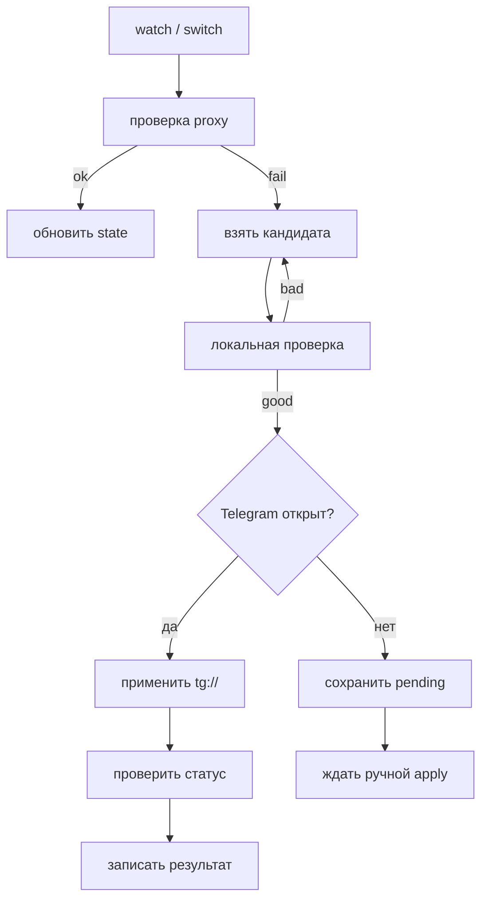

# ProtoSwitch

**ProtoSwitch v0.1.0-beta.11** — Windows CLI/TUI для Telegram Desktop, который следит за состоянием proxy, подбирает замену из бесплатных MTProto/SOCKS5-источников и помогает переключиться без ручной возни с адресами, портами и `secret`.

## Что Уже Есть

- terminal-first интерфейс с отдельными разделами `Обзор`, `Команды`, `Источники`, `История`;
- watcher для фоновой проверки и ротации proxy;
- автоматическая работа с `tg://proxy` и `tg://socks`;
- provider pool из нескольких бесплатных источников;
- автозапуск через `Scheduled Task` с fallback в `Startup folder`;
- installer и portable-сборка для Windows x64.

## Дистрибутивы

| Файл | Для чего |
| --- | --- |
| `ProtoSwitch-Setup-x64.exe` | обычная установка с ярлыками, uninstall entry и первичной инициализацией |
| `protoswitch-portable-win-x64.zip` | запуск без installer |

## Быстрый Старт

1. Установите `ProtoSwitch-Setup-x64.exe` или распакуйте portable-архив.
2. Запустите `protoswitch.exe`.
3. На первом старте проверьте параметры и сохраните конфиг.
4. При необходимости включите автозапуск watcher.
5. Откройте Telegram Desktop и проверьте состояние в разделе `Обзор`.

Если приложение уже установлено через installer, в меню `Пуск` есть:

- `ProtoSwitch`
- `Починить ProtoSwitch`
- `Удалить ProtoSwitch`

## Как Выглядит Управление

Запуск без аргументов открывает консоль управления.

- `Обзор` — текущее состояние proxy, watcher и Telegram.
- `Команды` — `switch`, `doctor`, запуск/остановка watcher, refresh, stop-all.
- `Источники` — активные provider-ленты и fallback-политика.
- `История` — последние найденные и применённые proxy.

Полезные команды CLI:

| Команда | Что делает |
| --- | --- |
| `protoswitch init` | создаёт или обновляет конфиг |
| `protoswitch status` | показывает снимок состояния |
| `protoswitch watch` | запускает watcher |
| `protoswitch switch` | сразу ищет и применяет новый proxy |
| `protoswitch doctor` | проводит диагностику |
| `protoswitch repair` | чинит локальную установку |
| `protoswitch shutdown` | останавливает фоновые процессы ProtoSwitch |
| `protoswitch autostart install` | включает автозапуск |
| `protoswitch autostart remove` | выключает автозапуск |

## Как Это Работает

1. ProtoSwitch проверяет текущий управляемый proxy.
2. Если он жив, состояние просто обновляется.
3. Если он деградировал, watcher идёт по provider pool.
4. Кандидат локально валидируется до применения.
5. Затем ProtoSwitch отдаёт в Windows `tg://proxy` или `tg://socks`.
6. Если Telegram доступен в текущей интерактивной сессии, приложение старается подтвердить переключение автоматически.

## Источники Proxy

По умолчанию в пул входят:

- `mtproto.ru`
- `SoliSpirit/mtproto`
- `Argh94/Proxy-List` для `MTProto`
- `Argh94/Proxy-List` для `SOCKS5`
- `proxifly/free-proxy-list`
- `hookzof/socks5_list`

ProtoSwitch не считает любой найденный адрес рабочим автоматически: перед применением кандидат проходит локальную проверку, а затем подтверждается в Telegram, если это возможно в текущей сессии.

## Автозапуск

ProtoSwitch пытается создать per-user `Scheduled Task`. Если Windows не даёт этого сделать, используется fallback в `Startup folder`.

В интерфейсе и в `doctor` видно, какой именно вариант сейчас активен:

- `scheduled_task`
- `startup_folder`

## Удаление

Если приложение ставилось через installer:

1. используйте `Удалить ProtoSwitch` или стандартный uninstall Windows;
2. installer сам снимает автозапуск;
3. пользовательские данные в `%APPDATA%\ProtoSwitch` и `%LOCALAPPDATA%\ProtoSwitch` по умолчанию не удаляются.

Если используется portable-версия:

1. выполните `protoswitch autostart remove`, если включали автозапуск;
2. выполните `protoswitch shutdown`;
3. удалите папку с portable-файлами.

## Ограничения Beta.11

- поддерживается только `Windows 10/11 x64`;
- приложение рассчитано только на `Telegram Desktop`;
- бесплатные proxy по природе нестабильны;
- авто-подтверждение Telegram работает только в той же интерактивной Windows-сессии, где реально открыт Telegram.
